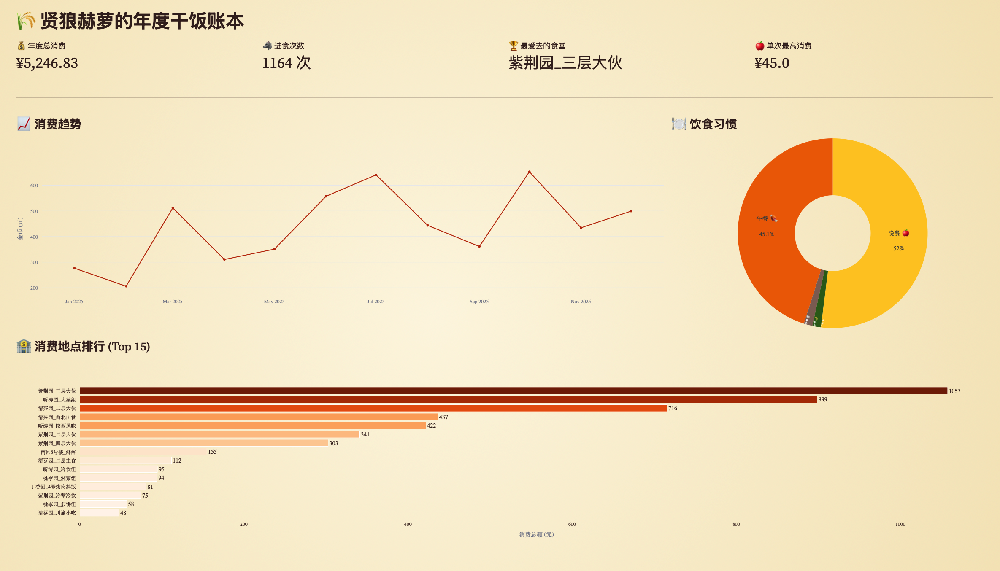

# THU Annual Eat Web UI - 贤狼赫萝的年度干饭账本 🐺🍎

> 一年过去了，你在华子食堂里花的钱都花在哪儿了？
> 本项目是 [THU-Annual-Eat](https://github.com/Rose-max111/THU-Annual-Eat) 的可视化增强分支。

## 📖 项目简介

这是一个基于 **Streamlit** 的清华大学校园卡消费数据可视化工具。

与原版脚本不同，本项目提供了一个全交互式的 Web 界面，采用「狼与香辛料」主题风格。它通过模拟登录校园卡中心，安全地拉取你的消费记录，并自动清洗数据（剔除充值、缴费等干扰项），生成详细的年度账单和多维度的消费图表。

### ✨ 主要特性

* **交互式 Web UI**：告别命令行，使用现代化界面管理你的账单。
* **贤狼主题**：定制化的 CSS 样式，带来温暖的视觉体验。
* **智能审计**：自动过滤“在线充值”、“圈存”、“网费”等非消费记录，只计算真实的干饭支出。
* **多维度分析**：
    * 📈 **消费趋势图**：按月统计“金币”流向。
    * 🍽️ **饮食习惯分析**：你是早起喝奶派还是深夜夜宵党？
    * 🏆 **地点排行**：生成你的 Top 15 常驻食堂榜单。
* **数据安全**：所有数据仅在本地运行处理，不会上传至任何第三方服务器。



## 🛠️ 安装与使用

### 1. 环境准备

请确保你的电脑上安装了 Python 3.8 或更高版本。

克隆或下载本项目后，安装所需的依赖库（主要包括 `streamlit`, `pandas`, `plotly`, `requests`, `pycryptodome`）：

```bash
pip install -r requirements.txt

```

> **注意**：在某些 Windows 环境下，`pycryptodome` 安装后文件夹名可能是 `crypto`（小写）。如果遇到报错，请在 `Python/Lib/site-packages` 目录下将其重命名为 `Crypto`（首字母大写）。

### 2. 启动应用

在项目根目录下运行以下命令：

```bash
streamlit run app.py

```

终端运行后，浏览器会自动打开 `http://localhost:8501`。

### 3. 获取通关文牒 (ServiceHall)

为了拉取数据，你需要获取校园卡系统的登录凭证。

1. 登录 [华清大学校园卡网站](https://card.tsinghua.edu.cn/userselftrade)。
2. 按下 `F12` 打开浏览器开发者工具，切换到 **Network (网络)** 标签页。
3. 按 `F5` 或 `Ctrl+R` 刷新页面。
4. 在请求列表中找到名为 `userselftrade` 的请求。
5. 查看该请求的 **Request Headers (请求头)** 中的 `Cookie` 字段。
6. 找到 `servicehall=` 后面的一长串字符（不包含 `servicehall=` 本身），这就是你的“通关文牒”。

### 4. 开始核算

在网页左侧边栏填写信息：

* **商人编号**：你的学号。
* **通关文牒**：上一步获取的 servicehall 字符串。
* **核算周期**：选择你想统计的时间范围（默认为当年）。

点击 **“开始核算账目 💰”** 即可生成报告。

## 📝 常见问题

* **Q: 为什么显示“账本为空”？**
* A: 通常是因为 `servicehall` 已过期（校园卡网站登录态失效）。请重新登录网站，获取最新的 Cookie。


* **Q: 我的充值记录去哪了？**
* A: 为了统计真实的饮食消费，程序内置了黑名单，自动过滤了包含“充值”、“圈存”、“财务”等关键词的记录。


## 📜 许可证 (LICENSE)

本项目采用 **CC BY-NC-SA 4.0** (署名-非商业性使用-相同方式共享) 国际许可协议 。

* **署名 (Attribution)**：您必须给出适当的署名，提供指向本许可协议的链接 。


* **非商业性使用 (NonCommercial)**：您不得将本素材用于商业目的 。


* **相同方式共享 (ShareAlike)**：如果您在本项目基础上进行改编、转换或构建，您必须基于相同的许可协议分发您贡献的作品 。


完整协议内容请参阅 [LICENSE](https://www.google.com/search?q=./LICENSE) 文件。

---

*Original project idea by [Rose-max111](https://github.com/Rose-max111).*
